# Ukraine Twitter invasion data
* [Link to data in google drive](https://drive.google.com/file/d/1jXWWuWduixXs13FxdICZNRqRTuLNcQo2/view?usp=drive_link)
* [Demo YouTube link](https://www.youtube.com/watch?v=cE-ye3fwMPU)

# 1. MapReduce

## 1.1 Dataset Description
The project delves into an analysis of a dataset centered around tweets concerning Ukraine during the initial month following Russia's invasion. The dataset itself is stored as a 5.4GB CSV file, containing approximately 20 million tweets. The time span of the data spans from February 27, 2022, to March 19, 2022, making it approximately 1.5 years old.

The value of this dataset lies in its potential to identify public sentiment on the conflict and attempt to identify bot-generated tweets. The bot-generated tweets in the first month of the conflict can be argued to essentially amount to cyber warfare. Furthermore, bot-driven misinformation campaigns can be shown to impact public sentiment.

The value of the dataset and its analysis can and has unveiled insights into sentiment patterns, identifying potential bots, and revealing trends during the first month following Russia's invasion of Ukraine.

## 1.2 MapReduce algorithm used:

The MapReduce algorithm used is a basic word count example. This code is virtually unchanged and sourced from: [Word Count Example using Hadoop and Java | by Code With Arjun](https://codewitharjun.medium.com/word-count-example-using-hadoop-and-java-8ef3d665e331). The reason for this basic word counting algorithm is that only a basic word count is all that is needed to aggregate the most common words, hashtags, locations for the analysis and visualization done.

## 1.3 MapReduce results discussion:

The results achieved by the MapReduce algorithm is as expected: a basic list of words and their occurrences listed next to them. There are however some pre-processing and post-processing steps done on several of the MapReduce inputs and outputs since the input data can often contain emojis, URLs and non-alphanumeric characters (!,@,$,&) of which only hashtags are useful for some of the analysis done. Furthermore, post-processing is also done on most of the results to throw away common words that provide no sentiment value in the text (‘and’, ‘a’, ‘if’, ‘when’, ‘or’) and to throw away invalid results (locations that don’t exist and are spoofed Eg: “earth”).

# 2. Visualization

## 2.1 Different data visualizations and specific ‘Value’ obtained from them

### 2.1.1 The top hashtags used in the dataset:
This shows that there are several hashtags that are used several times across twitter over the opening month of the invasion.

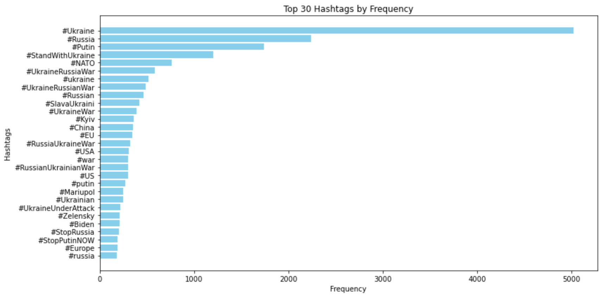

### 2.1.2 The top bad hashtags going against Ukraine that were used in the dataset:
This is done to get an estimate of the extent of the negative sentiment against each side of the war.

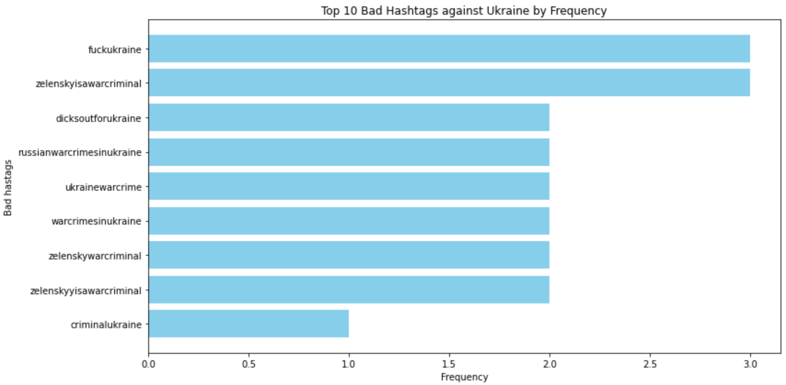

### 2.1.3 The top bad hashtags going against Russia that were used in the dataset:
This is done to get an estimate of the extent of the negative sentiment against each side of the war. There are clearly more negative hashtags aimed at Russia than Ukraine, which is what we would expect of the country that is invading the other country.

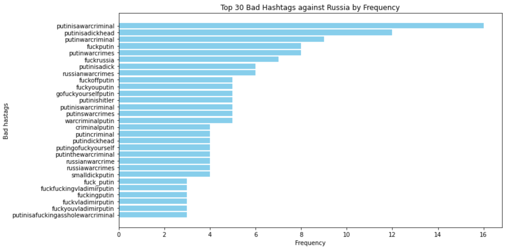

### 2.1.4 The top words used in the text of tweets in the dataset:
This is used to do an overall sentiment analysis of the text.

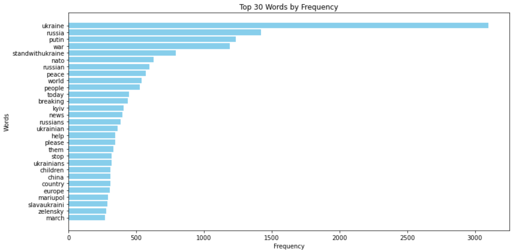

The overall sentiment analysis of the text is done and the following results are achieved:
* avg_weighted_sentiment = 0.019335522534243046
* avg_unweighted_sentiment = 0.028584415584415584

The average sentiments are both positive which is not what we would expect in war time.
However, if we take a look at the printed sentiments for each of the words above, most have no sentiment related to them and are neutral. Therefore, this analysis is somewhat pointless. Therefore the analysis of the sentiments of the negative tweets are more consequential.

### 2.1.5 Wordcloud of the top words used in the text which is scaled according to the frequency of occurrences of the words:
This shows that the most common words are “putin”, “russia”, “war”, and “standwithukraine”. This is a nice way of visualizing the histogram above and to put the relative frequency of occurrences of words in context.

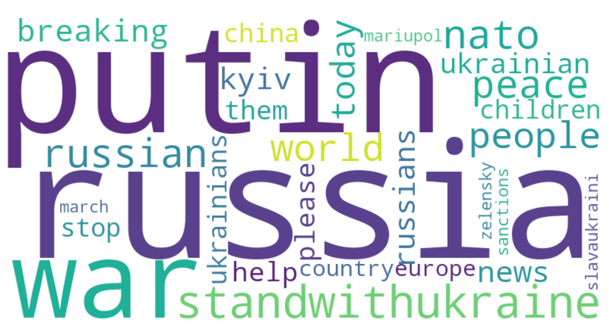

### 2.1.6 This is a 2D word2vec visualization of the top used words to represent how far they are away from each other in a vector space:
This illustrates why the overall average sentiments achieved are mostly near neutral. There are no clear clusters here which would make the text either overtly positive or negative. There are also both positive and negative anomalies in all directions that effectively cancel out their effects to result in an overall neutral sentiment.

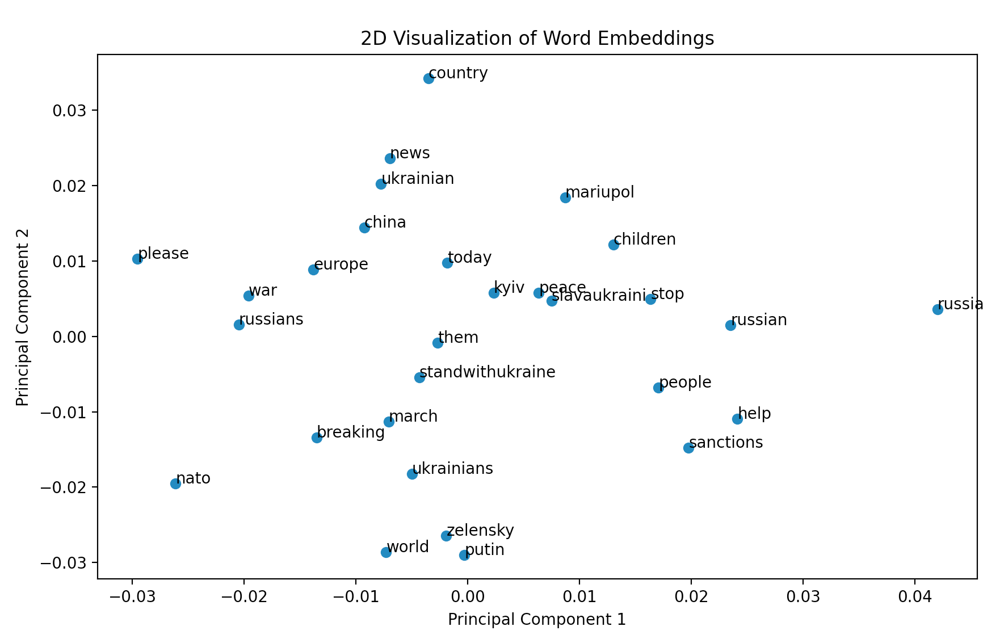

### 2.1.7 This shows the same above results achieved with a t-SNE algorithm to visualize the top words used in a 2D vector space:

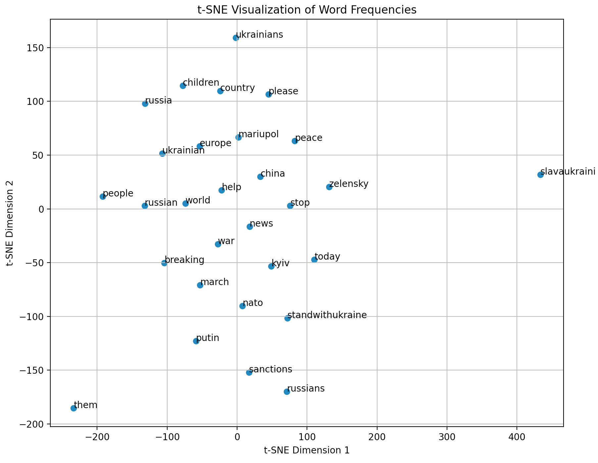

### 2.1.8 The top location hashtags that mention Ukrainian cities:
This can be used as a heuristic to show where the frontline of the war is, or where the most consequential cities in the battlefield are where fighting is currently happening.

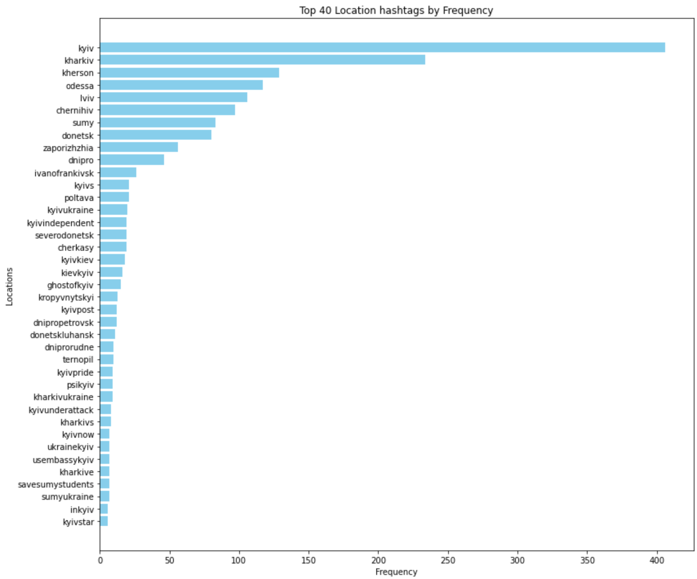

### 2.1.9 A map visualization of the top mentioned cities:
Most of the cities are either at the frontline/border with Russia and where the fighting is happening. This makes sense and is quite satisfying to see visualized like this.

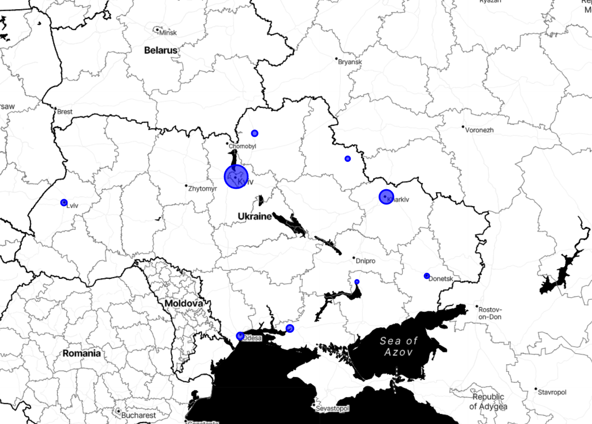

### 2.1.10 The top suspected bot locations for English only tweets:
This is based on accounts that have what is deemed to be too many tweets for the account age to be a normal human tweeting. Accounts that have more than 50 tweets a day on average for each year the account has been active is deemed to be a likely bot. This is a rudimentary method, but the results seem to line up with what is expected.

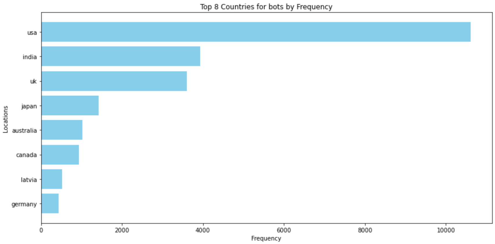

### 2.1.11 The top suspected bot locations for all language tweets:
This makes sense since most twitter users are from the USA. Therefore, the dataset can be said to be quite biased. This doesn’t help us much with analysis of the war sentiment, but it does show that most tweets about the war that could be bots are from the USA.

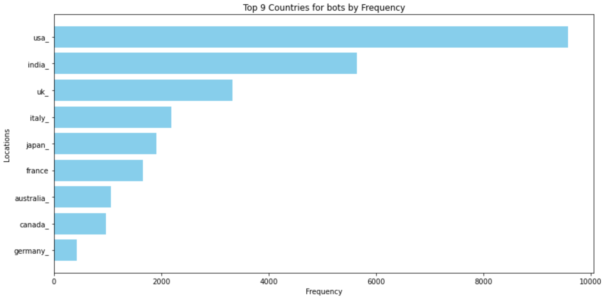

### 2.1.12 The top bot tweet locations are visualized in terms of their relative frequency of occurrence on a map:

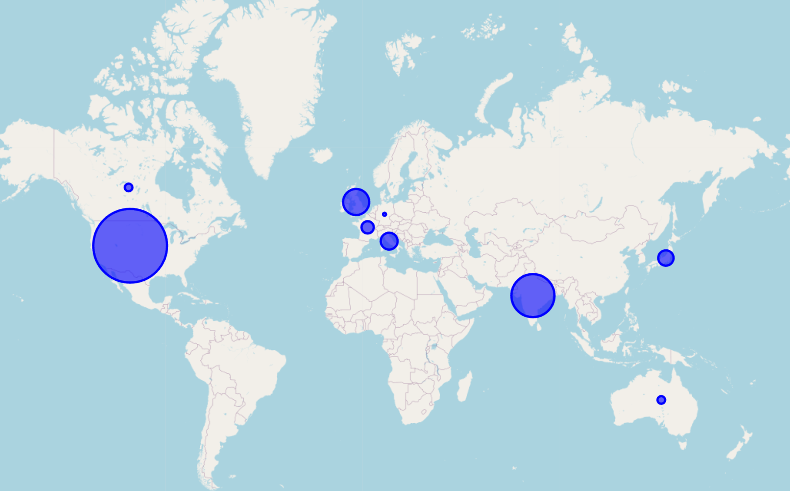

## 2.2 Overall takeaways and ‘Value’ obtained from analysis and visualization:

There is a more negative sentiment towards Russia and its leaders than towards Ukraine and its leaders
The most common bot country is the USA, followed by India. (India makes sense, since bot armies can easily be purchased in developing Asian countries) USA makes intuitive sense since it has the largest population of total twitter users. 
Another reason could be that in the USA there is more of an interest in the war than in other countries. Perhaps there are misinformation campaigns against Russia/Ukraine run by the parties in the USA but this is only speculation.

# References
* MapReduce basic word count code: [Word Count Example using Hadoop and Java | by Code With Arjun](https://codewitharjun.medium.com/word-count-example-using-hadoop-and-java-8ef3d665e331)
* Dataset downloaded from: BwandoWando. (2023). (🌇Sunset) 🇺🇦 Ukraine Conflict Twitter Dataset. Kaggle. [https://www.kaggle.com/dsv/5934908](https://www.kaggle.com/dsv/5934908). DOI: 10.34740/KAGGLE/DSV/5934908.

